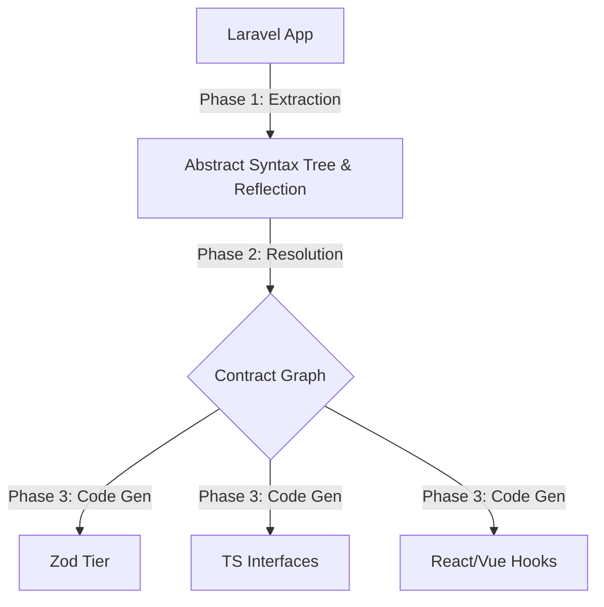

# RouteSync: The Contract Compiler Architecture

Sebagian besar *tool* di ekosistem Laravel -> TypeScript bekerja sebagai **Code Generator** sederhana. Mereka melihat tabel *database*, lalu mencetak `interface User`. Atau mereka melihat definisi *Route*, lalu mencetak fungsi *fetch*.

**RouteSync bukanlah Code Generator. RouteSync adalah sebuah Contract Compiler.**

RouteSync membaca keseluruhan "denyut nadi" aplikasi Laravel Anda—mulai dari skema database, Eloquent *casts*, FormRequest *rules*, hierarki *Controller*, hingga bentuk respons pada `Http/Resources`—lalu meramunya ke dalam satu sumber kebenaran absolut yang disebut **Contract Graph**. 

Dari Contract Graph inilah, RouteSync mencetak (*compile*) ekosistem *type-safe* untuk sisi *frontend*.

---

## Mengapa Bukan OpenAPI (Swagger)?

Pertanyaan klasik: *"Kenapa tidak pakai OpenAPI/Swagger saja?"*

OpenAPI adalah **Spesifikasi API**. Ia adalah lapisan *intermediary* (penengah). Untuk menggunakan OpenAPI, Anda harus mendefinisikan *schema* secara manual (menggunakan anotasi `@OA` yang panjang dan mengotori kode), atau mencoba men-generate-nya menggunakan *library* yang seringkali gagal menangkap kompleksitas dinamis Laravel.

**RouteSync adalah Lapisan Kompilasi Langsung.**
Anda tidak menulis spesifikasi API. Anda menulis kode Laravel standar (`FormRequest`, `JsonResource`, `Eloquent`). RouteSync menjadikan **kode Laravel Anda sebagai Spesifikasi API itu sendiri**. Tidak ada anotasi tambahan. Tidak ada duplikasi spesifikasi. Kode Laravel Anda *adalah* kontraknya. Ini adalah nilai yang jauh lebih sulit ditiru oleh standar generik seperti OpenAPI.

---

## Anatomi Contract Compiler

RouteSync bekerja dalam 3 fase utama (Pipeline Kompilasi):



### 1. Phase 1: Extraction (Static Analysis & Reflection)
RouteSync tidak hanya mengandalkan *Reflection API* bawaan PHP, karena beberapa hal (seperti isi array `toArray()` pada Resource) tidak bisa didapatkan via Reflection murni tanpa mengeksekusi kodenya. RouteSync menggunakan gabungan:
- **PHP Reflection:** Untuk mengekstrak parameter *route*, middleware, dan *controller*.
- **Database Schema SchemaBuilder:** Untuk mengekstrak tipe kolom murni.
- **Static AST Parsing (token_get_all):** Untuk membedah `FormRequest::rules()` dan `JsonResource::toArray()` tanpa harus menjalankan kode (menghindari error seperti `$this->id`).

### 2. Phase 2: Resolution (The Contract Graph)
Semua data mentah yang diekstrak kemudian diselesaikan (*resolved*) ke dalam **Contract Graph**. Ini adalah Representasi Intermediate (IR).

Dalam fase ini, RouteSync melakukan rekonsiliasi data. Contohnya pada **Tantangan Casts vs Migrations**:
Jika tabel *database* menyatakan kolom `settings` adalah `json` (Tipe string panjang), tetapi model Eloquent memiliki `protected $casts = ['settings' => 'array'];`, siapa yang menang?
**Contract Graph menobatkan Eloquent Model sebagai *Source of Truth*** untuk runtime, karena itulah yang akan diterima oleh *frontend*. Graph akan menimpa tipe DB dengan tipe *Casts*.

Contract Graph berbentuk pohon relasional:
- `Node: Route (POST /users)`
  - `Edge: Request Validation (rules: email|required, type|in:a,b)`
  - `Edge: Response Resource (UserResource)`
    - `Node: Resource Field (items -> CartItemResource)`

### 3. Phase 3: Code Generation (Emission)
Dari *Contract Graph*, RouteSync (di sisi Node.js/TypeScript) berjalan ke *frontend* untuk melakukan *Emission* menjadi artefak runtime:
- **`api-contract.ts`**: Skema Zod dari sisi *backend* (menggunakan `snake_case`). Mendukung `z.lazy` untuk relasi yang bersarang.
- **`api-read.ts` / `api-form.ts`**: Tipe-tipe TS murni untuk *frontend* (ditransformasi ke `camelCase`).
- **`api-mapper.ts`**: Fungsi transformasi runtime yang sangat cepat untuk memetakan objek Zod (snake_case) ke tipe UI (camelCase).
- **`hooks.ts`**: Pembungkus untuk TanStack Query (`useQuery`, `useMutation`).

---

## Melampaui Batas: Skenario Kompleks (Edge Cases)

Sebagai sebuah *compiler*, arsitektur RouteSync didesain untuk bisa memecahkan skenario validasi dan struktur data yang paling *"jahat"* sekalipun:

### 1. Conditional Validation (`required_if`, `required_without`)
Alih-alih hanya mencetak `z.object({...})`, aturan kondisional diubah menjadi skema Zod dengan `.superRefine()`. Contract Compiler mem-parsing relasi kondisional dan memancarkan logika *runtime validation* ke *frontend*.
```typescript
// Laravel: 'company_name' => 'required_if:type,company'
z.object({
  type: z.enum(['personal', 'company']),
  companyName: z.string().optional()
}).superRefine((data, ctx) => {
  if (data.type === 'company' && !data.companyName) {
    ctx.addIssue({ code: z.ZodIssueCode.custom, message: "Required" });
  }
})
```

### 2. Dynamic Resources (`whenLoaded`)
Saat Contract Compiler melihat `$this->whenLoaded('user')`, ia menyadari bahwa relasi ini dinamis. Dalam hal *type inference*, field ini akan ditandai secara eksplisit sebagai **opsional** (`?` dalam TypeScript, `.optional()` dalam Zod). *Frontend developer* dipaksa secara aman oleh *type system* untuk melakukan *null-checking* sebelum mengakses `post.user.name`, karena *compiler* tahu bahwa relasi tersebut bisa jadi tidak di-*eager load* oleh query.

### 3. Custom Resource Collections
Jika `toArray()` mengembalikan struktur custom seperti `['data' => ..., 'meta' => ...]`, *Static Analyzer* (Phase 1) kita mem-parsing blok array tersebut secara harfiah. *Contract Graph* akan membentuk struktur bersarang yang sama, dan *ZodTierGenerator* akan mencetak `data: z.array(...)` dan `meta: z.object(...)` dengan akurasi 100%.

### 4. Polymorphic Relations (`morphTo`)
Untuk menangani `commentable_type`, Contract Compiler membutuhkan petunjuk tentang entitas apa saja yang mungkin ada (misalnya via pemetaan *morph map* di `AppServiceProvider`). Begitu Contract Graph mengetahui relasinya (`Post | Video | Article`), generator akan memancarkan:
```typescript
commentable: z.discriminatedUnion("commentable_type", [
  z.object({ commentable_type: z.literal("Post"), ...PostSchema }),
  z.object({ commentable_type: z.literal("Video"), ...VideoSchema })
])
```
Ini memberikan *Type Inference* tingkat dewa langsung di sisi *frontend* saat melakukan operasi `switch(item.commentable_type)`.

### 5. FormRequest Reuse & Bundle Optimization
Dalam *project* berskala *enterprise*, payload bisa membengkak. Alih-alih membuat skema duplikat untuk `StoreUserRequest` dan `UpdateUserRequest`, Contract Graph menghitung *hash* dari komposisi *rules*. Jika mereka memiliki basis yang sama, *compiler* akan mencetak **Base Schema**, lalu menggunakan `.partial()` atau `.omit()` untuk mengimplementasikan *composition over inheritance*. Ini menjaga ukuran *bundle JavaScript* tetap ramping sekecil apapun skalanya.

---

Dengan pola arsitektur **Extraction -> Resolution -> Emission**, RouteSync benar-benar meruntuhkan batas antara Laravel dan frontend. Ia bukan lagi sekadar jembatan; ia adalah *compiler* yang menjadikan kode backend Anda memiliki gravitasi penuh terhadap *safety* dan *DX (Developer Experience)* di sisi frontend.
